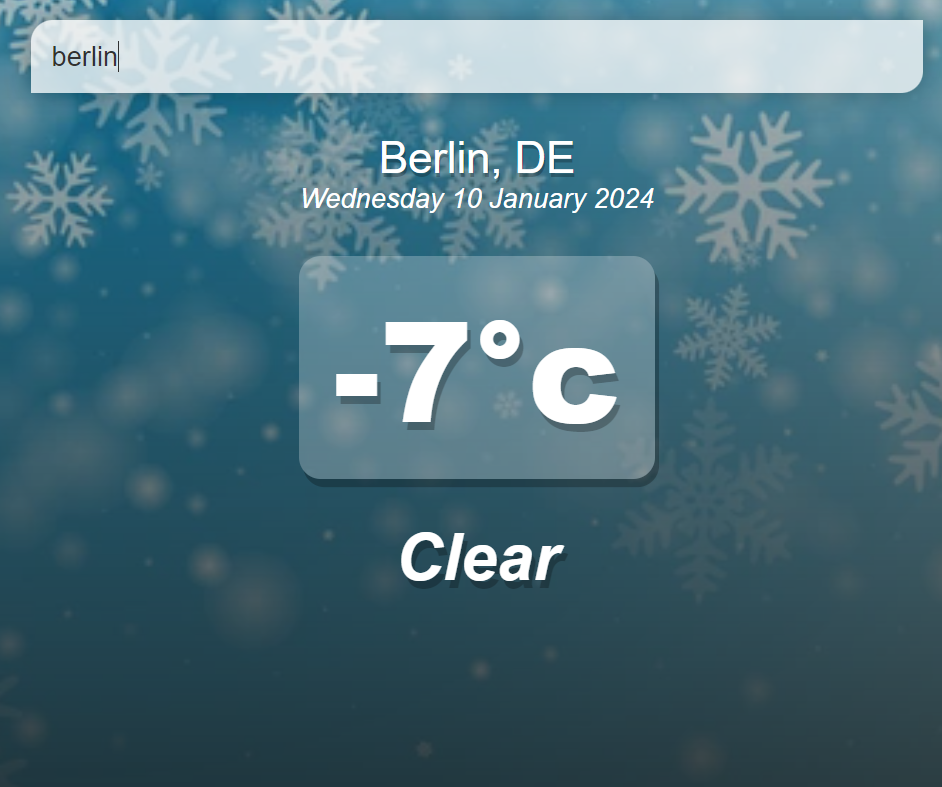
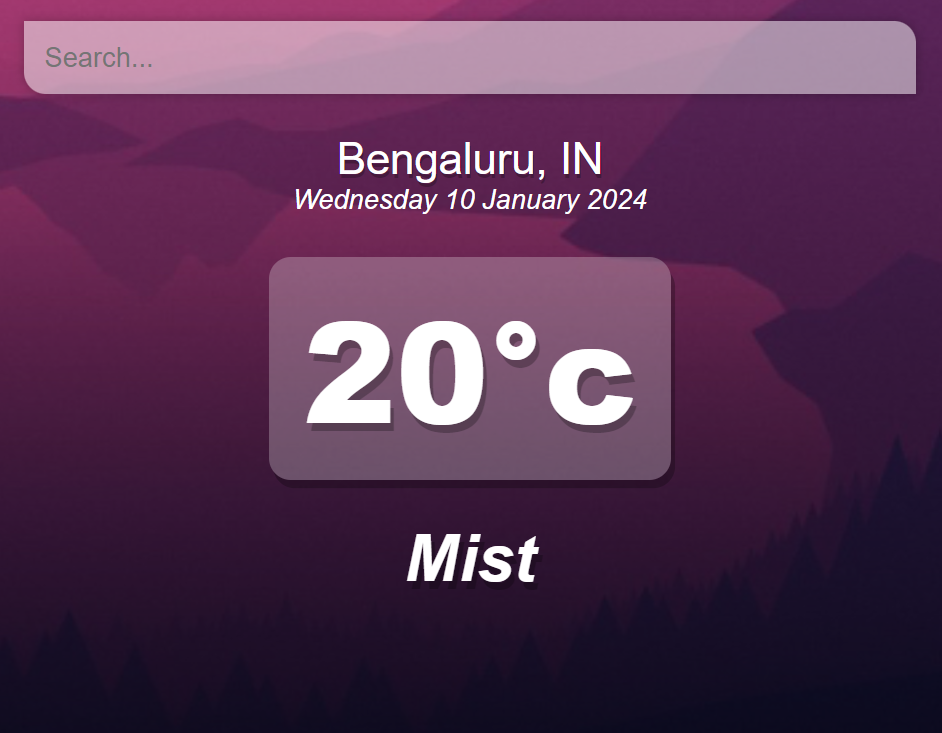

# weath-vue

## Project setup
```
npm install
```

### Compiles and hot-reloads for development
```
npm run serve
```

### Compiles and minifies for production
```
npm run build
```

### Output

Give the name of the location in search bar to get Weather Information 


